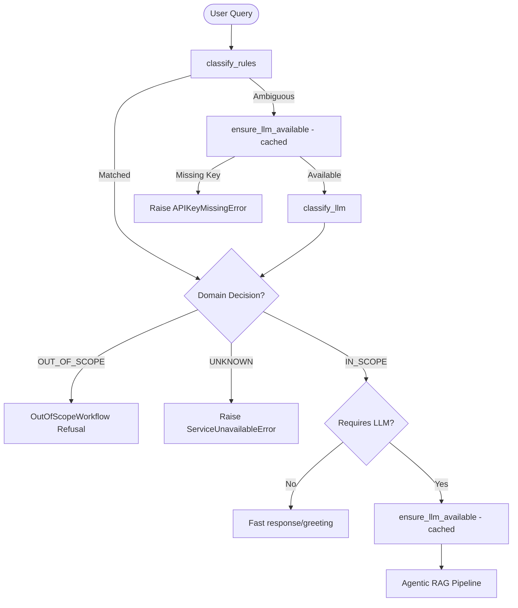

# Design Specification: Domain Guardrail & API Key Validation (Approach C - Refined)

## 1. Overview
This specification details the implementation of a robust, clean architecture for domain classification and API key credential validation. It separates logic for domain filtering (Vietnam history check) from infrastructural checks (API key validation), preventing masked errors and ensuring correct user feedback.

## 2. Components & Interfaces

### 2.1. DomainClassifier (`apps/api/app/agents/domain_classifier.py`)
Responsible *only* for resolving whether a query is within scope (Vietnamese history/greetings), out-of-scope, or unknown.

```python
from enum import Enum
from typing import Literal

class DomainDecision(str, Enum):
    IN_SCOPE = "IN_SCOPE"
    OUT_OF_SCOPE = "OUT_OF_SCOPE"
    UNKNOWN = "UNKNOWN"

class DomainResult:
    decision: DomainDecision
    confidence: float
    source: Literal["rule", "llm", "fallback"]
    reason: str

class DomainClassifier:
    def classify_rules(self, query: str) -> DomainResult | None:
        """
        Runs deterministic rule checks: greetings, years, keywords.
        Returns DomainResult if matched, otherwise None (ambiguous).
        """
        ...

    async def classify_llm(self, query: str) -> DomainResult:
        """
        Queries LLM for domain classification. 
        If LLM classification fails (timeout, connection, exception), 
        it fails CLOSED but safely as UNKNOWN:
            returns DomainResult(decision=DomainDecision.UNKNOWN, confidence=0.0, source="fallback", reason="...")
        """
        ...

    async def classify(self, query: str) -> DomainResult:
        """
        Rules check first. If rules are ambiguous, executes LLM classification.
        """
        ...
```

### 2.2. APIKeyMissingError (`apps/api/app/core/exceptions.py`)
A semantic exception raised when the active LLM provider key is missing.

```python
class APIKeyMissingError(HistoriAIException):
    """Custom exception raised when an LLM API Key is missing or invalid."""
    def __init__(self, provider: str = ""):
        super().__init__(
            message="API_KEY_MISSING: Không tìm thấy cấu hình mô hình ngôn ngữ.",
            public_message="Không tìm thấy cấu hình mô hình ngôn ngữ.\n\nVui lòng thêm API Key trong phần Cài đặt trước khi sử dụng chức năng hỏi đáp nâng cao của HistoriAI.",
            details={"provider": provider}
        )
```

### 2.3. CredentialValidator (`apps/api/app/core/credentials.py`)
Responsible for verifying that LLM API keys are valid and present. Made asynchronous to support future vault retrieval or connection checks.

```python
class CredentialValidator:
    async def ensure_llm_available(self) -> None:
        """
        Inspects active LLM credentials.
        Raises APIKeyMissingError if the key is not configured.
        """
        ...
```

### 2.4. Refusal Message Format (`apps/api/app/services/agent/workflows/out_of_scope.py`)
For out-of-scope queries (e.g., `"bạn biết messi ko"`), the system returns this exact refusal format:
```text
HistoriAI chuyên hỗ trợ nghiên cứu và tra cứu lịch sử Việt Nam.

Câu hỏi của bạn nằm ngoài phạm vi chuyên môn của hệ thống, nên tôi không thể cung cấp câu trả lời đáng tin cậy.

Bạn có thể hỏi về:
• Các triều đại Việt Nam
• Nhân vật lịch sử
• Các cuộc kháng chiến
• Sự kiện lịch sử Việt Nam
• Chính sách và cải cách qua các thời kỳ
```

## 3. Orchestration Flow (`apps/api/app/agents/orchestrator.py`)
We perform **Credential Caching** at the query orchestrator context layer so that `ensure_llm_available` is called at most once per query pipeline execution.

If `domain_res.decision` is `UNKNOWN`, the orchestrator raises a `ServiceUnavailableError("LLM (Domain Classifier)")` instead of rejecting it as out-of-scope.



## 4. Presentation & Exceptions (`apps/api/app/factory.py`)

### 4.1. HTTP Status Compromise
Although a missing key is technically a backend configuration dependency error (`503` or `424`), we compromise and map it to `400 Bad Request` at the presentation layer for backward compatibility with the React frontend UI setting checks.

```python
@app.exception_handler(APIKeyMissingError)
async def api_key_missing_handler(request, exc: APIKeyMissingError):
    return JSONResponse(
        status_code=400,
        content={"detail": f"API_KEY_MISSING: {exc.public_message}"},
    )
```

## 5. Metrics Instrumentation
The following Prometheus metrics are tracked:
* `historiai_domain_classified_total{source, decision}`: Counter incremented on every query domain classification.
* `historiai_api_key_missing_total{provider}`: Counter tracking occurrences of missing keys.
* `historiai_out_of_scope_total`: Counter tracking out-of-scope request volume.
* `historiai_greeting_total`: Counter tracking greeting request volume.

## 6. Test Plan
1. **Out-of-Scope Redirect test**: Assert that `"bạn biết messi không?"` matches `decision=OUT_OF_SCOPE` via rule-based checks and returns the correct out-of-scope format.
2. **Missing Key test**: Mock no active API key and verify that an in-scope query (e.g. `"Hiệp định Geneva"`) returns `400 Bad Request` with the standardized error message.
3. **Greeting Early Route test**: Assert that `"Xin chào"` matches the greeting intent and skips search/LLM RAG completely, returning the greeting response.
4. **LLM Fail Closed (UNKNOWN) test**: Simulate LLM timeout/failure during classification of an ambiguous query, ensuring the classifier fails to `DomainDecision.UNKNOWN` and the orchestrator raises `ServiceUnavailableError`.
5. **Streaming Missing Key test**: Verify that streaming endpoint `/api/v1/query/stream` successfully yields an SSE error event with type `"error"` containing `"API_KEY_MISSING"` when no key is set.
6. **Provider Switch validation**: Verify that switching LLM provider from Gemini to Groq performs validation on the correct keys respectively.
7. **Credential caching test**: Verify that calling `ensure_llm_available` twice in the same query returns instantly via cache and the underlying check is executed exactly once.
