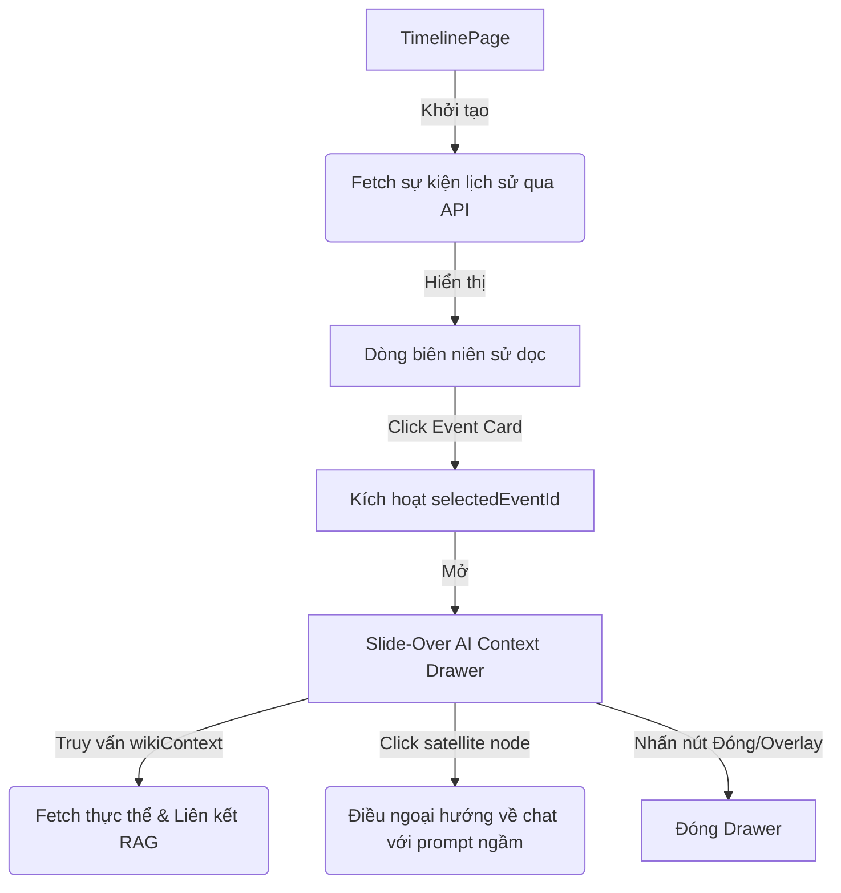

# Spec Thiết kế: Historical Knowledge Explorer Redesign

Mục tiêu của tài liệu thiết kế này là chuyển đổi trang dòng thời gian (`TimelinePage.tsx`) hiện tại từ cấu trúc dạng Dashboard thông thường thành một **Trình khám phá Tri thức Lịch sử** mang tính trải nghiệm cao (kết hợp lưu trữ bảo tàng và trợ lý AI NotebookLM), tối ưu hóa trải nghiệm đọc biên niên sử và tương tác RAG.

---

## 1. Yêu cầu & Bố cục Giao diện (Layout Specification)

### A. Thanh điều hướng dọc (Slim Sidebar Navigation Rail)
- **Kích thước:** Chiều rộng cố định `64px` (`w-16`).
- **Nội dung:** Hiển thị Logo hoa sen vàng tối giản (`🌸`) ở đỉnh đầu, theo sau là 5 biểu tượng đơn giản xếp dọc:
  1. Trang chủ (`Home` / `/chat`)
  2. Dòng thời gian (`Clock` / `/timeline`)
  3. Nhân vật (`User` / `/wiki`)
  4. Tài liệu (`FileText` / `/documents`)
  5. AI Assistant (`Bot` / `/brain-builder`)
- **Trạng thái:** Dành toàn bộ bề rộng màn hình còn lại cho nội dung chính, không hiển thị text mở rộng trừ khi hover hoặc trên màn hình nhỏ thu về dưới dạng bottom bar di động.

### B. Vùng Khám phá Chính (Main Content Area - 100% chiều rộng hiển thị)
- **Tiêu đề & Tìm kiếm (Header):**
  - Tiêu đề chữ Serif lớn: `LỊCH SỬ VIỆT NAM`.
  - Phụ đề chữ nhỏ tinh tế: `Khám phá dòng chảy lịch sử bằng Trí tuệ Nhân tạo`.
  - Tích hợp một thanh tìm kiếm ngữ nghĩa duy nhất làm tiêu điểm điều khiển ở giữa hoặc góc trên bên phải.
- **Bộ lọc thời kỳ (Era Filters):**
  - Thiết kế dạng các chip bo tròn (`rounded-full`) màu sắc nhã nhặn đại diện cho các kỷ nguyên (Pháp, Mỹ, Hiện đại).
- **Dòng chảy biên niên sử (Vertical Stream Timeline):**
  - Dành **60-70% chiều cao màn hình** để cuộn đọc mốc thời gian dọc.
  - Một đường trục dọc mảnh ở giữa hoặc lề trái kết nối các mốc năm.
  - Loại bỏ hoàn toàn biểu đồ cuộn ngang ở trên và bảng biên niên sử ở dưới.

### C. Thẻ Sự kiện Lưu trữ (Museum Exhibit Label Cards)
- **Kiểu dáng:** Cắt góc vuông vắn hoặc bo góc rất nhẹ (`rounded-sm`), viền siêu mảnh, không dùng shadow đậm để tránh cảm giác sticky note.
- **Chi tiết thẻ:**
  - Năm xuất hiện rõ ràng dạng chữ lớn ở đầu.
  - Tên sự kiện sử dụng font Serif đậm.
  - 2-3 dòng trích đoạn bối cảnh (summary) in nghiêng (`italic`).
  - Liên kết nhỏ ở chân thẻ biểu thị số lượng nhân vật, tài liệu liên quan.

### D. Panel AI Context Drawer (Slide-Over Drawer)
- **Cơ chế:** Khi nhấp chọn sự kiện, Panel chi tiết sẽ trượt ra từ cạnh phải đè lên nội dung (`fixed right-0 top-0 h-full w-[380px] z-50 bg-[#faf8f3] shadow-2xl transition-transform duration-300`).
- **Overlay:** Một lớp backdrop phủ mờ mỏng (`bg-black/10 backdrop-blur-xs`) che phủ nội dung phía dưới, nhấn chuột vào overlay sẽ đóng drawer lại.
- **Nội dung Panel:**
  - Tiêu đề sự kiện và năm.
  - Phân tích bối cảnh nhanh ("Tại sao quan trọng?") ngắn gọn 3 dòng.
  - Sơ đồ liên kết thực thể (Mini Interactive Knowledge Graph) dạng vệ tinh vẽ bằng CSS/SVG.
  - Gợi ý câu hỏi nhanh (NotebookLM-style prompts) như: *"Giải thích bối cảnh lịch sử"* hoặc *"Ảnh hưởng lâu dài"*.
  - Nút kêu gọi hành động ở đáy: *"Hỏi trợ lý AI"* hoặc *"Đọc chi tiết Wiki"*.

---

## 2. Loại bỏ Dividers (Divider Reduction)
- Giảm thiểu 40% các đường biên (borders/dividers) ngang không cần thiết.
- Thay thế các nét đứt dày bằng khoảng trống (white space) rộng rãi và nền tương phản mềm giữa các phần.

---

## 3. Kiến trúc Luồng Dữ liệu (Data & Interaction Flow)

